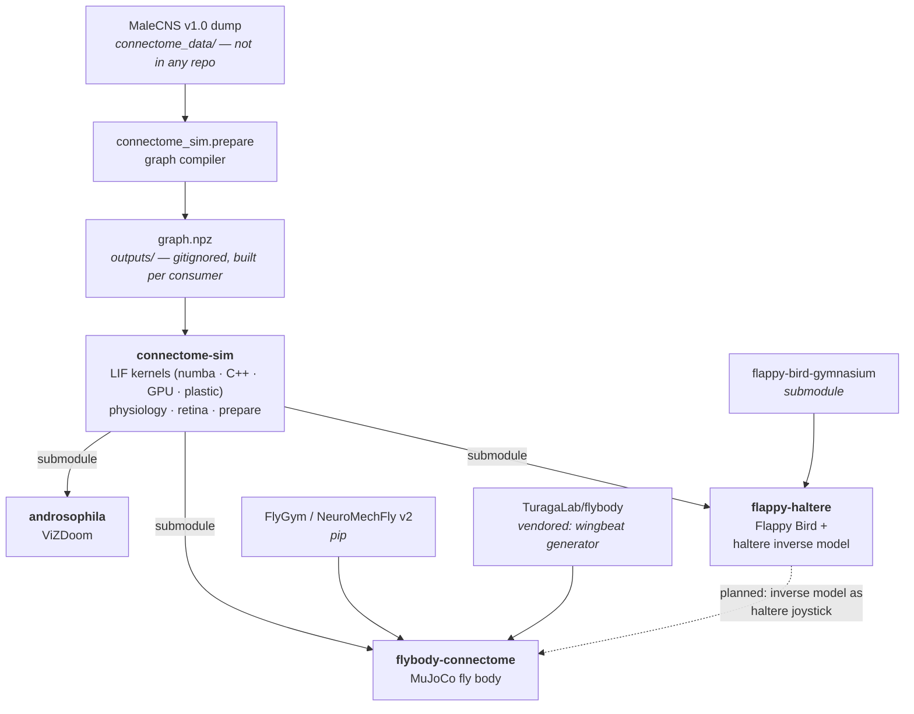

# connectome-sim

A reusable MaleCNS v1.0 connectome simulator: connectome import, a
leaky-integrate-and-fire native (C++) kernel, and a CuPy GPU backend, plus
shared photoreceptor-sampling and dopamine-gated-plasticity physiology code.

This is a fork of [nftechie/doomfly](https://github.com/nftechie/doomfly),
split out of the [androsophila](https://github.com/jamesbiederbeck/androsophila)
fork so the engine can be reused by more than one game harness. The GPU
backend (`gpu.py`, `gpu_attempts/`, `benchmark_gpu.py`, `validate_gpu.py`)
was added in that fork and has an open PR back to the original author.

Meant to be consumed as a **git submodule** (mounted at a path named
`connectome_sim` in the consuming repo, so `import connectome_sim.native`
etc. resolves) rather than installed as a standalone package — several
modules compute paths relative to the consuming repo's root, one level above
this repo's own root.

## Layout

| Path | Contents |
| --- | --- |
| `engine.py`, `native.py`, `gpu.py`, `kernel.cpp` | The `Brain` base class and its native/GPU backends |
| `connectome.py`, `prepare.py`, `transmitters.py`, `datasets.json`, `download_dataset.py` | MaleCNS importer, graph compilation and dataset registry |
| `provenance.py`, `audit_data.py`, `export_glossary.py`, `export_android.py`, `build_kernel.py` | Build, audit and export tooling |
| `vision/` | Game-agnostic photoreceptor-sampling interface |
| `physiology/` | Generic dopamine-gated-plasticity code (calibrated against Huang et al. 2024 targets); the ViZDoom-specific experiment harness around it stays in the DOOMFLY-fork repo |
| `data-provenance/`, `research/` | Dataset and physiology-target provenance |
| `licenses/` | Third-party notices for material cited here (MaleCNS CC-BY-4.0, Shiu LIF-framework MIT) |
| `tests/` | Numerical and unit checks for the above |

## How the repos relate

This repo is the shared engine. It has no harness of its own: each consumer
mounts it as a submodule at its own root, and supplies the world.

Solid edges exist; the dashed one does not yet.

Every consumer builds its own `graph.npz` by running `connectome_sim.prepare`
against its own copy of the MaleCNS inputs. The graph is deterministic, so they
agree — but it is gitignored everywhere, and neither it nor the inputs are
published. A fresh clone runs `prepare` before anything works.

| repo | world | role |
| --- | --- | --- |
| [connectome-sim](https://github.com/jamesbiederbeck/connectome-sim) | none | the engine, and the graph compiler |
| [androsophila](https://github.com/jamesbiederbeck/androsophila) | ViZDoom | the original DOOMFLY experiment this was split out of |
| [flappy-haltere](https://github.com/jamesbiederbeck/flappy-haltere) | Flappy Bird | a second game, plus an MLP that inverts haltere stimulation to a target motor response |
| [flybody-connectome](https://github.com/jamesbiederbeck/flybody-connectome) | MuJoCo | the fly's own body as the world, rather than a game |

The direction of travel is the dashed edge: `flappy-haltere` already trains the
inverse model that turns a desired wing-muscle response into a haltere
stimulation pattern, which is the joystick `flybody-connectome` wants for
perturbing flight. Sharing it means sharing `inverse_model.npz` as data, not
merging the repos.

See [THIRD_PARTY.md](THIRD_PARTY.md) for full attribution.
